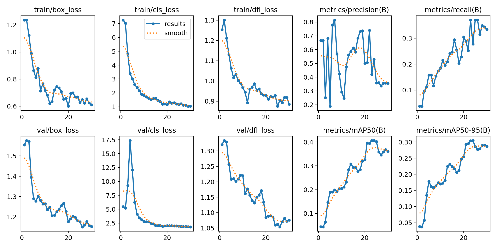
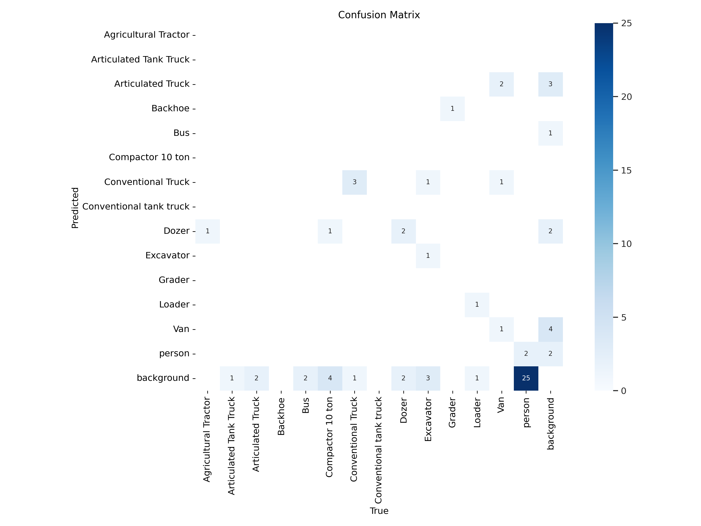
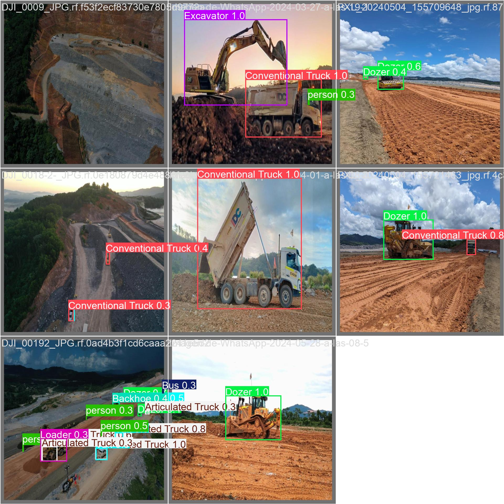

# Detección de Equipos de Construcción con YOLOv8

MAIC – Tarea de Visión Computacional (M4T3)  
Autor: **Ambar María Figueroa Figari**

---

# 1. Descripción del Proyecto

Este proyecto implementa un modelo de **detección de objetos basado en YOLOv8** para identificar maquinaria pesada y vehículos utilizados en obras de construcción.

El objetivo es demostrar el flujo completo de desarrollo de un sistema de visión computacional aplicado al sector **AECO (Architecture, Engineering, Construction and Operations)**.

El pipeline del proyecto incluye:

- Preparación y anotación del dataset
- Entrenamiento del modelo YOLOv8
- Evaluación del desempeño del modelo
- Generación de predicciones en imágenes nuevas
- Análisis de errores del modelo

# Pesos del modelo

Los pesos del modelo entrenado pueden encontrarse en:

weights/best.pt

Este archivo corresponde al modelo YOLOv8 entrenado durante el experimento.
---

# 2. Problema AECO

En proyectos de construcción es importante poder **identificar y monitorear automáticamente la maquinaria presente en obra**, con el fin de mejorar:

- control operativo
- seguridad en obra
- seguimiento de equipos
- análisis de productividad

Los modelos de visión computacional permiten automatizar esta tarea mediante **detección automática de objetos en imágenes o video**.

Este proyecto entrena un modelo para detectar diferentes tipos de equipos de construcción.

---

# 3. Dataset

El dataset fue preparado utilizando la plataforma **Roboflow**.

Dataset:  
https://app.roboflow.com/ambars-workspace/tarea-m4t3_v2/models/tarea-m4t3_v2/2

El dataset contiene imágenes etiquetadas manualmente con **bounding boxes** alrededor de cada objeto.

### Clases del modelo

El modelo fue entrenado para detectar las siguientes clases:

- Excavator
- Dozer
- Grader
- Loader
- Agricultural Tractor
- Compactor 10 ton
- Articulated Truck
- Articulated Tank Truck
- Conventional Truck
- Van
- Bus
- Person

### Reglas de etiquetado

- Las bounding boxes fueron dibujadas ajustadas al objeto visible.
- Solo se anotaron objetos claramente identificables.
- Objetos parcialmente visibles fueron etiquetados cuando era posible reconocer su clase.

### División del dataset

El dataset fue dividido en:
Train
Validation
Test

con un split aproximado **80 / 20**.

---

# 4. Modelo

El modelo fue entrenado utilizando **YOLOv8s** del framework Ultralytics.

Configuración de entrenamiento:

| Parámetro | Valor |
|----------|------|
Modelo | YOLOv8s |
Epochs | 30 |
Image size | 640 |
Framework | Ultralytics YOLOv8 |
Entorno | Google Colab (GPU Tesla T4) |

Versión de Ultralytics utilizada:
ultralytics==8.2.103

---

# 5. Resultados del Modelo

Métricas obtenidas en el conjunto de validación:

| Métrica | Resultado |
|-------|------|
Precision | 0.53 |
Recall | 0.278 |
mAP50 | 0.406 |
mAP50-95 | 0.305 |

El modelo presenta un desempeño moderado, con una precisión aceptable pero un recall relativamente bajo, lo que indica que algunos objetos presentes en las imágenes no son detectados.

---

# 6. Resultados Visuales

## Curvas de entrenamiento

Estas curvas muestran la evolución de las métricas del modelo durante el entrenamiento.

---

## Matriz de confusión

La matriz de confusión permite analizar qué clases presentan mayor nivel de confusión.

---

## Ejemplo de detección

Ejemplo de predicción generada por el modelo YOLOv8 entrenado.

---

# 7. Evidencias del modelo

La carpeta `results/evidence/` incluye:

- ejemplos de anotaciones del dataset
- predicciones del conjunto de validación
- predicciones sobre imágenes nuevas

Estas evidencias permiten evaluar visualmente el desempeño del modelo.

## Predicciones en imágenes nuevas

Para evaluar la capacidad de generalización del modelo, se realizaron inferencias sobre imágenes que **no formaban parte del dataset de entrenamiento ni del conjunto de validación**.

Las siguientes imágenes muestran ejemplos de detección realizados por el modelo YOLOv8 entrenado.

### Predicción 1

### Predicción 2

### Predicción 3

### Predicción 4

### Predicción 5

Estas predicciones permiten observar cómo el modelo detecta diferentes tipos de maquinaria en escenarios no vistos durante el entrenamiento.
---

# 8. Análisis de errores

Las métricas obtenidas indican que el modelo tiene una **precision moderada (0.53)** pero un **recall relativamente bajo (0.278)**.

Esto sugiere que el modelo logra detectar correctamente algunos objetos, pero **no logra detectar todos los objetos presentes en las imágenes**.

### Falsos positivos

1. Algunos loaders fueron clasificados como excavators debido a similitud visual.
2. Algunos trucks fueron detectados como articulated trucks.
3. Vehículos parcialmente visibles generaron detecciones incorrectas.

### Falsos negativos

1. Objetos pequeños o lejanos no fueron detectados.
2. Algunas personas presentes en la escena no fueron identificadas.
3. Equipos parcialmente ocluidos no fueron detectados correctamente.

### Análisis por clases

Las métricas por clase permiten identificar qué tipos de objetos son detectados con mayor o menor precisión.

Clases con mejor desempeño

Algunas clases presentan resultados relativamente altos:

Van

Precision: 0.541

Recall: 1.0

mAP50: 0.945

Esto indica que el modelo logra identificar correctamente esta clase en la mayoría de los casos.

Conventional Truck

Precision: 0.371

Recall: 0.75

mAP50: 0.801

Esto sugiere que el modelo logra reconocer adecuadamente este tipo de vehículo en las imágenes.

Grader

Precision: 1.0

mAP50: 0.995

Sin embargo, esta métrica puede estar influenciada por el bajo número de ejemplos en el dataset, lo cual puede inflar el resultado.

### Clases con bajo desempeño

Algunas clases presentan dificultades claras para el modelo.

Articulated Truck

mAP50: 0.015

mAP50-95: 0.012

Esto indica que el modelo prácticamente no logra detectar correctamente esta clase.

Bus

Precision: 0

Recall: 0

Esto sugiere que el modelo no detectó correctamente ningún bus en el conjunto de validación.

Person

Precision: 0.494

Recall: 0.185

Esto indica que el modelo tiene dificultades para detectar personas, posiblemente debido al tamaño pequeño del objeto en la imagen.

### Principales causas de error

Los resultados observados pueden explicarse por varios factores:

1. Dataset pequeño

El conjunto de validación contiene solo 8 imágenes, lo cual limita la capacidad de evaluar correctamente el desempeño del modelo.

Datasets pequeños también afectan la capacidad del modelo para aprender patrones visuales robustos.

### 2. Desbalance entre clases

Algunas clases tienen muy pocos ejemplos:

Por ejemplo:

Agricultural Tractor: 1 instancia
Grader: 1 instancia

Esto dificulta que el modelo aprenda características representativas para esas clases.

### 3. Similitud visual entre equipos

Muchos equipos de construcción tienen características visuales similares:

loaders vs excavators

trucks vs articulated trucks

Esto puede generar confusión entre clases.

### 4. Tamaño del objeto en la imagen

Objetos pequeños o parcialmente visibles pueden ser difíciles de detectar.

Esto explica el recall bajo, ya que el modelo tiende a omitir algunos objetos presentes.

### Recomendaciones para mejorar el modelo

Para mejorar el desempeño del modelo se recomiendan las siguientes acciones:

### Aumentar el tamaño del dataset

Incorporar más imágenes para cada clase permitiría mejorar la generalización del modelo.

### Balancear las clases

Mantener una distribución más uniforme entre clases ayudaría a evitar sesgos durante el entrenamiento.

### Aplicar técnicas de data augmentation

Técnicas como:

rotación

escalado

variación de iluminación

pueden mejorar la capacidad del modelo para generalizar.

### Incrementar las épocas de entrenamiento

Entrenar el modelo durante más épocas podría mejorar la convergencia del entrenamiento.

### Mejoras propuestas (Resumen)

- aumentar el tamaño del dataset
- balancear el número de ejemplos por clase
- incluir mayor variedad de ángulos e iluminación
- aumentar el número de épocas de entrenamiento

---

# 9. Reproducibilidad

Para reproducir este proyecto:

1. Abrir el notebook en Google Colab.
2. Instalar dependencias:
pip install ultralytics roboflow

3. Autenticarse en Roboflow.
4. Descargar el dataset.
5. Ejecutar el entrenamiento o cargar los pesos entrenados.
6. Ejecutar inferencia sobre nuevas imágenes.

Última ejecución verificada en Colab:
- GPU utilizada: Tesla T4
- Tiempo de ejecución aproximado: 20–30 minutos

---

# 10. Estructura del repositorio
Tarea-M4T3_v2
│
├── notebooks
│
├── docs
│ ├── class_definitions.md
│ ├── error_analysis.md
│ └── governance_checklist.md
│
├── results
│ ├── curves
│ └── evidence
│
└── weights

---

# 11. Pesos del modelo

Los pesos del modelo entrenado se encuentran en:

weights/best.pt

---

# 12. Gobernanza y uso responsable

Este proyecto sigue principios básicos de IA responsable.

Privacidad:
El dataset utilizado no contiene información personal identificable.

Limitaciones:
El modelo puede presentar menor precisión en condiciones de baja iluminación, oclusión parcial o presencia de maquinaria no incluida en el dataset.

Riesgos:
El modelo puede generar falsos positivos y falsos negativos, por lo que no debe utilizarse como único sistema de decisión en entornos críticos.

---

# 13. Licencia

Este proyecto se distribuye bajo la licencia **MIT License**.

---
## Documentación del proyecto

Presentación del proyecto:

[Ver presentación](docs/Presentacion.pdf)

Mini informe del proyecto:

[Ver informe](docs/Resumen.pdf)

# Autor

Ambar María Figueroa Figari  
MAIC – Proyecto de Visión Computacional

